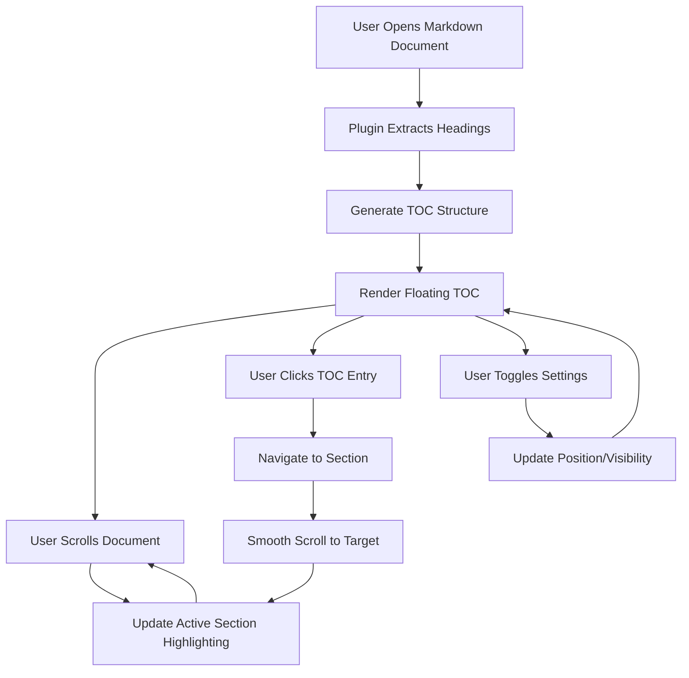

# Floating TOC Plugin - Product Requirements Document

## 1. Product Overview

The Floating TOC plugin is an Obsidian plugin that provides a floating, interactive table of contents sidebar for markdown documents. It automatically extracts headings (H1-H6) and displays them in a hierarchical structure with real-time navigation and active section highlighting.

The plugin addresses the challenge of navigating lengthy markdown files by offering quick navigation shortcuts and visual context about the user's current position within the document structure.

## 2. Core Features

### 2.1 Feature Module

Our Floating TOC plugin consists of the following main components:

1. **Data Models**: Core interfaces and mock data structures for development
2. **Static UI Components**: React component hierarchy for TOC display
3. **Interactive Features**: Navigation, scroll tracking, and state management
4. **Settings Panel**: Configuration interface for user preferences
5. **Plugin Integration**: Obsidian API integration and lifecycle management

### 2.2 Page Details

| Component            | Module Name              | Feature Description                                                             |
| -------------------- | ------------------------ | ------------------------------------------------------------------------------- |
| Data Models          | TocEntry Interface       | Define heading structure with id, text, level, element, and children properties |
| Data Models          | TocState Interface       | Manage plugin state including entries, activeEntry, isVisible, and position     |
| Data Models          | PluginSettings Interface | Configure position, appearance, and behavior options                            |
| Data Models          | Mock Data Generator      | Create sample TOC data for development and testing                              |
| Static UI            | TocContainer Component   | Main wrapper with fixed positioning (left/right middle)                         |
| Static UI            | TocItem Component        | Individual heading entries with hierarchical indentation                        |
| Static UI            | TocControls Component    | Toggle visibility and position controls                                         |
| Interactive Features | Navigation Handler       | Click-to-navigate with smooth scrolling to target sections                      |
| Interactive Features | Scroll Tracker           | Real-time active section detection using Intersection Observer                  |
| Interactive Features | State Management         | Minimal UI state representation and data flow                                   |
| Settings Panel       | Settings Manager         | Persist user preferences across Obsidian sessions                               |
| Settings Panel       | Settings UI              | Native Obsidian settings tab integration                                        |
| Plugin Integration   | Obsidian API Integration | Document change detection and event system integration                          |
| Plugin Integration   | Theme Adaptation         | Use Obsidian CSS variables for consistent styling                               |

## 3. Core Process

### Development Workflow (React-Style Approach)

**Phase 1: Data Modeling**

1. Define core interfaces (TocEntry, TocState, PluginSettings)
2. Create mock data generators for development
3. Establish data structures before UI implementation

**Phase 2: Static UI Components**

1. Break UI into component hierarchy
2. Build TocContainer as main wrapper
3. Implement TocItem for individual entries
4. Create TocControls for user interactions
5. Focus on layout and styling without interactivity

**Phase 3: Interactive Features**

1. Find minimal but complete UI state representation
2. Identify where state should live in component tree
3. Add click navigation and scroll tracking
4. Implement inverse data flow for user interactions

**Phase 4: Integration and Polish**

1. Integrate with Obsidian API and event system
2. Add settings management and persistence
3. Implement error handling and edge cases
4. Optimize performance and finalize styling

### User Operation Flow



## 4. User Interface Design

### 4.1 Design Style

* **Primary Colors**: Use Obsidian's CSS variables (--interactive-accent, --text-normal)

* **Secondary Colors**: --text-muted, --background-secondary for hierarchy

* **Button Style**: Rounded corners matching Obsidian's design patterns

* **Font**: Inherit from Obsidian's --font-interface with size --font-ui-small

* **Layout Style**: Fixed positioning sidebar with card-based entry design

* **Icons**: Use Obsidian's built-in icon set (lucide icons)

### 4.2 Page Design Overview

| Component        | Module Name     | UI Elements                                                                                                                                                                                               |
| ---------------- | --------------- | --------------------------------------------------------------------------------------------------------------------------------------------------------------------------------------------------------- |
| TocContainer     | Main Wrapper    | Fixed position (left: 20px or right: 20px), top: 50%, transform: translateY(-50%), max-width: 300px, background: --background-primary, border: 1px solid --background-modifier-border, border-radius: 8px |
| TocItem          | Heading Entry   | Padding based on heading level (level \* 12px), hover: --background-modifier-hover, active: --interactive-accent with --text-on-accent, cursor: pointer, font-size: --font-ui-small                       |
| TocControls      | Toggle Controls | Position at top of container, flex layout, icon buttons with --interactive-normal background, hover: --interactive-hover                                                                                  |
| Active Indicator | Current Section | Left border: 3px solid --interactive-accent, background: --background-modifier-hover, font-weight: 500                                                                                                    |

### 4.3 Responsiveness

The plugin is desktop-first with mobile-adaptive considerations:

* Fixed positioning adjusts for smaller screens (min-width: 768px)

* TOC width scales down on narrow viewports (min-width: 250px)

* Touch interaction optimization for mobile Obsidian usage

* Collapsible design for space-constrained environments

## 5. Technical Implementation Strategy

### 5.1 Data Models First Approach

```typescript
// Core interfaces defined before UI implementation
interface TocEntry {
  id: string;
  text: string;
  level: number; // 1-6 for H1-H6
  element: HTMLElement;
  children: TocEntry[];
}

interface TocState {
  entries: TocEntry[];
  activeEntry: string | null;
  isVisible: boolean;
  position: 'left' | 'right';
}

// Mock data for development
const mockTocData: TocEntry[] = [
  {
    id: 'heading-1',
    text: 'Introduction',
    level: 1,
    element: null, // Mock element
    children: [
      {
        id: 'heading-1-1',
        text: 'Overview',
        level: 2,
        element: null,
        children: []
      }
    ]
  }
];
```

### 5.2 Component Hierarchy Planning

```
TocContainer (Main Component)
├── TocControls (Settings Toggle)
├── TocList (Scrollable Container)
│   └── TocItem (Recursive for Hierarchy)
│       ├── TocItemText
│       ├── TocItemIcon (if has children)
│       └── TocItem (Nested children)
└── TocFooter (Optional status info)
```

### 5.3 State Management Strategy

* **Minimal State**: Only store essential data (entries, activeEntry, isVisible, position)

* **State Location**: Top-level TocContainer manages all state

* **Data Flow**: Props down, callbacks up pattern

* **Performance**: Use React.memo for TocItem to prevent unnecessary re-renders

### 5.4 Progressive Enhancement

1. **Static Version**: Display mock TOC data without interactivity
2. **Click Navigation**: Add onClick handlers for section jumping
3. **Scroll Tracking**: Implement Intersection Observer for active section
4. **Settings Integration**: Add user preference management
5. **Obsidian Integration**: Connect to document events and API

