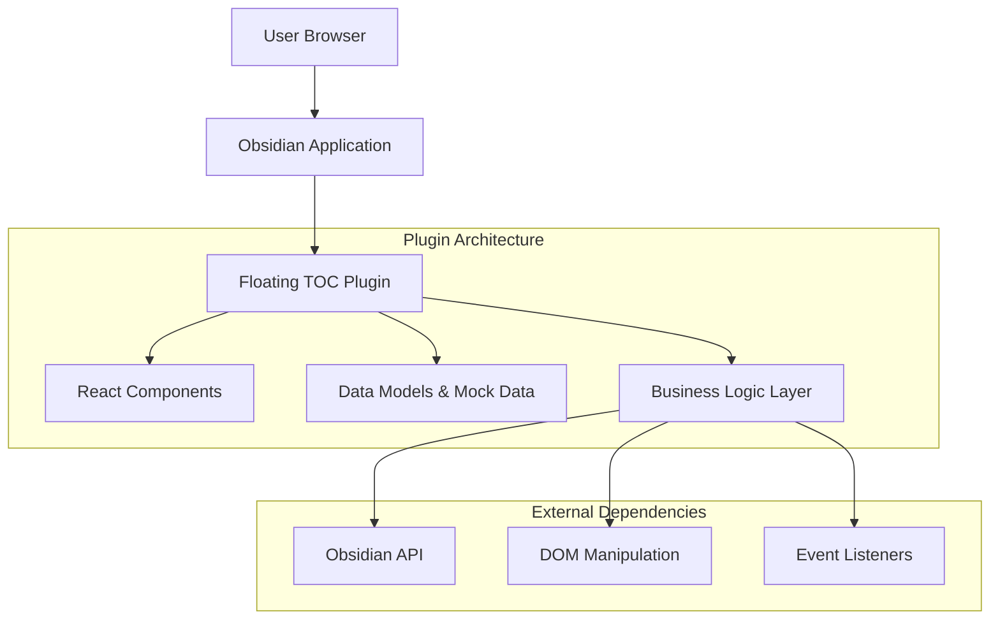

# Floating TOC Plugin - Technical Architecture Document

## 1. Architecture Design



## 2. Technology Description

* **Frontend**: React\@18 + TypeScript\@4.9 + Obsidian Plugin API

* **Build System**: esbuild (Obsidian standard)

* **Styling**: CSS with Obsidian CSS Variables

* **State Management**: React useState/useEffect (no external state library)

* **Testing**: Jest + React Testing Library

* **Backend**: None (client-side only plugin)

## 3. Component Structure

### 3.1 React Component Hierarchy

```
FloatingTocPlugin (Obsidian Plugin Class)
└── TocView (React Root Component)
    ├── TocContainer (Main Wrapper)
    │   ├── TocHeader
    │   │   ├── TocTitle
    │   │   └── TocControls (Toggle/Settings)
    │   ├── TocList (Scrollable Container)
    │   │   └── TocItem (Recursive Component)
    │   │       ├── TocItemContent
    │   │       ├── TocItemIcon (Expand/Collapse)
    │   │       └── TocItem[] (Nested Children)
    │   └── TocFooter (Optional Status)
    └── TocSettings (Settings Panel)
```

### 3.2 Data Flow Architecture

```mermaid
graph LR
    A[Document Change] --> B[HeadingExtractor]
    B --> C[TocEntry[]]
    C --> D[TocState]
    D --> E[React Components]
    E --> F[User Interaction]
    F --> G[NavigationHandler]
    G --> H[Obsidian API]
    H --> I[Document Scroll]
    I --> J[ScrollTracker]
    J --> D
```

## 4. Data Models

### 4.1 Core Interfaces

```typescript
// Primary data structure for TOC entries
interface TocEntry {
  id: string;                    // Unique identifier for navigation
  text: string;                  // Heading text content
  level: number;                 // Heading level (1-6)
  element: HTMLElement | null;   // DOM reference (null in mock data)
  children: TocEntry[];          // Nested headings
  isExpanded?: boolean;          // For collapsible sections
}

// Plugin state management
interface TocState {
  entries: TocEntry[];           // Current document TOC structure
  activeEntry: string | null;    // Currently highlighted section
  isVisible: boolean;            // TOC visibility toggle
  position: 'left' | 'right';    // Fixed position preference
  isLoading: boolean;            // Loading state for async operations
}

// User preferences
interface PluginSettings {
  isVisible: boolean;
  position: 'left' | 'right';
  appearance: {
    width: number;               // TOC width in pixels
    maxHeight: number;           // Maximum height before scrolling
    fontSize: 'small' | 'medium' | 'large';
  };
  behavior: {
    autoHide: boolean;           // Hide when not hovering
    smoothScroll: boolean;       // Smooth scroll animation
    collapseNested: boolean;     // Collapse nested sections by default
    showLevelNumbers: boolean;   // Show heading level indicators
  };
}

// Mock data for development
interface MockDataGenerator {
  generateSimpleToc(): TocEntry[];
  generateNestedToc(): TocEntry[];
  generateLargeToc(): TocEntry[];
  generateEmptyToc(): TocEntry[];
}
```

### 4.2 Mock Data Implementation

```typescript
class MockTocData implements MockDataGenerator {
  generateSimpleToc(): TocEntry[] {
    return [
      {
        id: 'intro',
        text: 'Introduction',
        level: 1,
        element: null,
        children: []
      },
      {
        id: 'features',
        text: 'Features',
        level: 1,
        element: null,
        children: [
          {
            id: 'core-features',
            text: 'Core Features',
            level: 2,
            element: null,
            children: []
          }
        ]
      }
    ];
  }

  generateNestedToc(): TocEntry[] {
    // Complex nested structure for testing
    return [
      {
        id: 'chapter-1',
        text: 'Chapter 1: Getting Started',
        level: 1,
        element: null,
        children: [
          {
            id: 'section-1-1',
            text: '1.1 Installation',
            level: 2,
            element: null,
            children: [
              {
                id: 'subsection-1-1-1',
                text: '1.1.1 Prerequisites',
                level: 3,
                element: null,
                children: []
              }
            ]
          }
        ]
      }
    ];
  }
}
```

## 5. Business Logic Layer

### 5.1 Core Classes

```typescript
// Heading extraction from document
class HeadingExtractor {
  extractHeadings(container: HTMLElement): TocEntry[] {
    // Implementation for scanning H1-H6 elements
  }
  
  buildHierarchy(headings: HTMLElement[]): TocEntry[] {
    // Build nested structure from flat heading list
  }
  
  generateUniqueIds(entries: TocEntry[]): void {
    // Ensure all headings have unique IDs for navigation
  }
}

// Scroll position tracking
class ScrollTracker {
  private observer: IntersectionObserver;
  
  startTracking(entries: TocEntry[], callback: (activeId: string) => void): void {
    // Initialize Intersection Observer
  }
  
  stopTracking(): void {
    // Cleanup observers
  }
  
  getCurrentSection(): string | null {
    // Determine which section is currently active
  }
}

// Navigation handling
class NavigationHandler {
  navigateToSection(entryId: string, smoothScroll: boolean = true): void {
    // Scroll to target heading with optional smooth animation
  }
  
  validateTarget(entryId: string): boolean {
    // Ensure target element exists before navigation
  }
}

// Main coordination class
class TocManager {
  private extractor: HeadingExtractor;
  private tracker: ScrollTracker;
  private navigator: NavigationHandler;
  
  constructor() {
    this.extractor = new HeadingExtractor();
    this.tracker = new ScrollTracker();
    this.navigator = new NavigationHandler();
  }
  
  initialize(container: HTMLElement): TocState {
    // Extract headings and initialize tracking
  }
  
  updateToc(container: HTMLElement): TocEntry[] {
    // Re-extract headings when document changes
  }
  
  cleanup(): void {
    // Stop tracking and cleanup resources
  }
}
```

## 6. React Component Implementation

### 6.1 Component Props and State

```typescript
// Main container component
interface TocContainerProps {
  entries: TocEntry[];
  activeEntry: string | null;
  isVisible: boolean;
  position: 'left' | 'right';
  settings: PluginSettings;
  onNavigate: (entryId: string) => void;
  onToggleVisibility: () => void;
  onUpdateSettings: (settings: Partial<PluginSettings>) => void;
}

// Individual TOC item component
interface TocItemProps {
  entry: TocEntry;
  isActive: boolean;
  isExpanded: boolean;
  onNavigate: (entryId: string) => void;
  onToggleExpand: (entryId: string) => void;
  settings: PluginSettings['appearance'];
}

// Settings panel component
interface TocSettingsProps {
  settings: PluginSettings;
  onUpdate: (settings: Partial<PluginSettings>) => void;
  onClose: () => void;
}
```

### 6.2 State Management Strategy

```typescript
// Main plugin state hook
function useTocState(initialEntries: TocEntry[] = []) {
  const [state, setState] = useState<TocState>({
    entries: initialEntries,
    activeEntry: null,
    isVisible: true,
    position: 'right',
    isLoading: false
  });
  
  const updateEntries = useCallback((entries: TocEntry[]) => {
    setState(prev => ({ ...prev, entries, isLoading: false }));
  }, []);
  
  const setActiveEntry = useCallback((entryId: string | null) => {
    setState(prev => ({ ...prev, activeEntry: entryId }));
  }, []);
  
  const toggleVisibility = useCallback(() => {
    setState(prev => ({ ...prev, isVisible: !prev.isVisible }));
  }, []);
  
  return {
    state,
    updateEntries,
    setActiveEntry,
    toggleVisibility
  };
}
```

## 7. Development Phases

### Phase 1: Data Models and Mock Data (Week 1)

* Define all TypeScript interfaces

* Implement mock data generators

* Create basic plugin structure

* Set up build system and testing framework

### Phase 2: Static UI Components (Week 2)

* Build React component hierarchy

* Implement styling with Obsidian CSS variables

* Create responsive layout system

* Test with mock data across different scenarios

### Phase 3: Interactive Features (Week 3)

* Add click navigation functionality

* Implement scroll tracking with Intersection Observer

* Connect state management between components

* Add keyboard shortcuts and accessibility features

### Phase 4: Integration and Polish (Week 4)

* Integrate with Obsidian API and event system

* Implement settings persistence

* Add error handling and edge case management

* Performance optimization and final testing

## 8. Performance Considerations

### 8.1 React Optimization

* Use React.memo for TocItem components to prevent unnecessary re-renders

* Implement virtual scrolling for documents with 100+ headings

* Debounce scroll events and document change detection

* Lazy load nested sections for large documents

### 8.2 Memory Management

* Cleanup Intersection Observers on component unmount

* Remove event listeners when plugin is disabled

* Use WeakMap for element-to-entry mappings

* Implement proper cleanup in useEffect hooks

## 9. Testing Strategy

### 9.1 Unit Testing

* Test data model interfaces with various input scenarios

* Mock Obsidian API calls for isolated component testing

* Test business logic classes independently

* Validate mock data generators produce correct structures

### 9.2 Component Testing

* Test React components with React Testing Library

* Verify proper rendering with different TOC structures

* Test user interactions (clicks, keyboard navigation)

* Validate accessibility features and ARIA attributes

### 9.3 Integration Testing

* Test plugin lifecycle within Obsidian environment

* Verify document change detection and TOC updates

* Test settings persistence across sessions

* Validate theme adaptation and CSS variable usage

