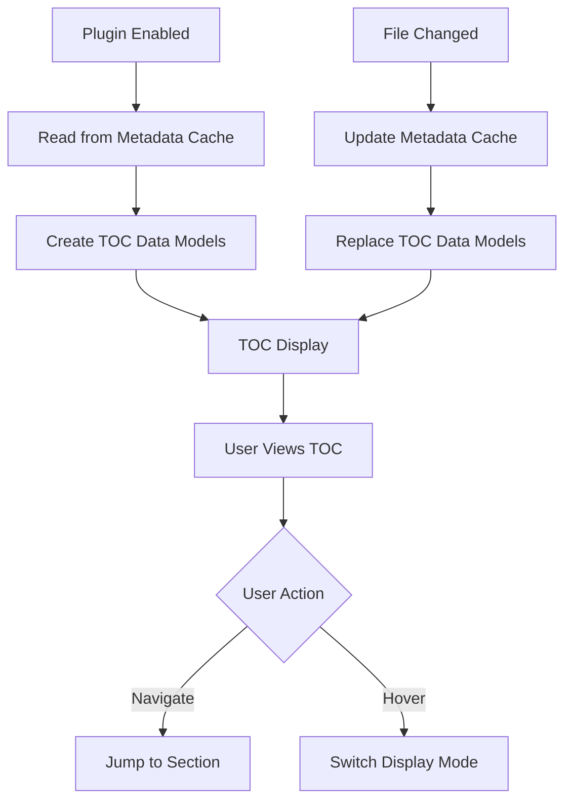

# Overview

The plugin mounts a lightweight React root as a floating overlay within the Obsidian workspace. The overlay renders a Table of Contents (TOC) that operates in two display modes sharing the same data source:
- Preview mode: compact tree hierarchy for quick structure overview (default state)
- Detail mode: interactive scrollable table of contents (appears on hover, closes when mouse leaves)

Both modes access the same headings list from metadataCache - they differ only in display style and interaction level. The active heading is tracked using line-based position detection. 

Layer Architecture:
- Data Layer: Convert Obsidian data to data interface
- Repository Layer:
1.  Our target is to exposed const apis for business logic: getDisplayData(), getCurrentHeadings(),Navigate().
especially the data interface is affect how the heading-match strategy works.
2. Our target is to expose a domain-specific model. This model will contain only data relevant to our business cases — in other words it should be completely decoupled from the specific API provide and raw data format
- UI Layer: 


# Data Structure
## Interface

```typescript
// Canonical data model shared by Preview and Detail
interface TocNode {
  id: string;
  text: string;
  level: 1 | 2 | 3;
  lineStart: number;
  lineEnd: number;
  isActive: boolean;
  children: TocNode[];
}

interface TocState {
  mode: 'Preview' | 'Detail';
  roots: TocNode[]; // single source of truth
  activeItemId: string | null;
  scrollAnchorLine: number;
}

enum TocMode {
  Preview = 'Preview',
  Detail = 'Detail'
}

interface PluginSettings {
  widthPx: number;
  maxVisibleItems: number;
  depthLimit: 3;
  position: 'middle-left';
  hoverSwitchEnabled: boolean;
}

// Events

type onModeChanged = (mode: TocMode) => void;
type onActiveFileChanged = (file: TFile) => void;


```


# UI Components

- FloatTocContainer: fixed overlay at middle-left; 
- PreviewTree: compact tree in the shape of a line with different lengths for different levels
- TocTree: table of contents showing 5–8 items at once; scrollable; active item highlighted; heading text truncated with ellipsis. width constrained with content-first strategy, height constrained with cognitive load theory.
- TocItem: heading text item with level-based indentation .

## Design Token
All styling relies on Obsidian CSS variables to match themes and avoid hard-coded colors.

# Data Flow



## CRUD Operations Summary
- **Create**: Plugin activation generates initial TOC data models
- **Read**: TOC displays current data models to user
- **Update/Delete**: File changes trigger data model replacement


# Obsidian API integration

- Lifecycle: extend Plugin; mount in onload, unmount in onunload
- Container: append overlay root to app.workspace.containerEl with a scoped class for positioning
- Headings: metadataCache.getFileCache(file)?.headings; listen to metadataCache/vault change events to refresh
- Active view: workspace.on('active-leaf-change', ...) to detect file/view switches; validate MarkdownView
- Settings: addSettingTab, persist with loadData/saveData
- Theming: use Obsidian CSS variables (e.g., --text-normal, --background-secondary) and avoid hard-coded colors

## How React components access Obsidian APIs
- TypeScript interfaces for ObsidianAppProviderProps
- useObsidianApp() hook with proper error handling
- usePluginData<T>() placeholder hook for extensibility


