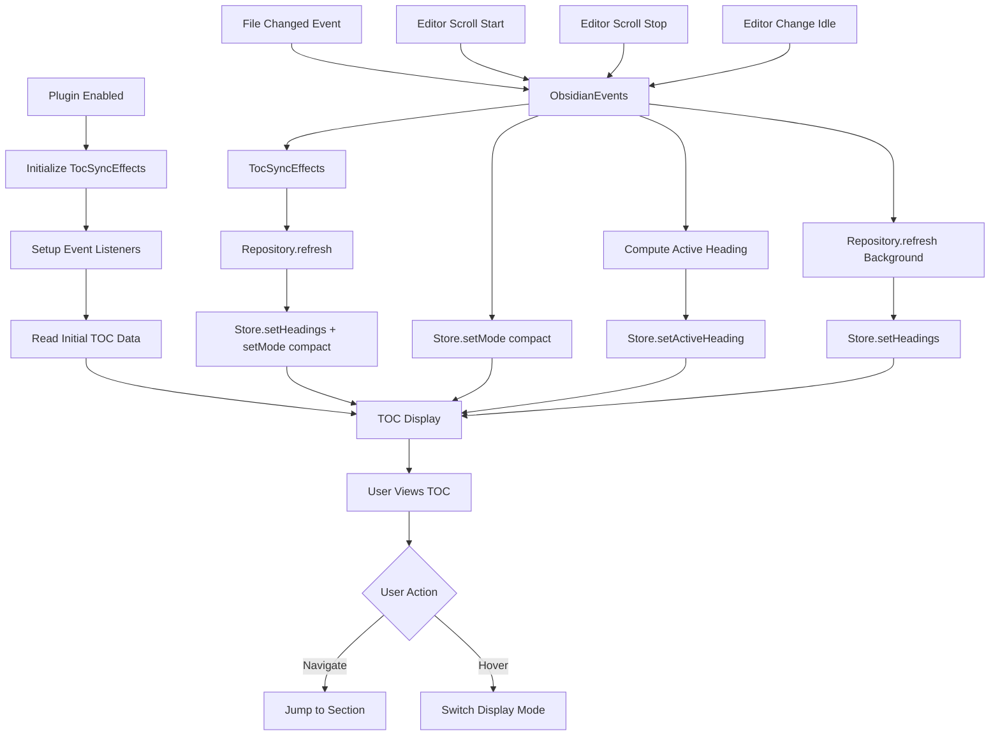

# Overview

The plugin mounts a lightweight React root as a floating overlay within the Obsidian workspace. The overlay renders a Table of Contents (TOC) that operates in two display modes sharing the same data source:
- Preview mode: compact tree hierarchy for quick structure overview (default state)
- Detail mode: interactive scrollable table of contents (appears on hover, closes when mouse leaves)

Both modes access the same headings list from metadataCache - they differ only in display style and interaction level. The active heading is tracked using line-based position detection. 

Layer Architecture:
- Data Layer: Convert Obsidian data to data interface
- Repository Layer:
1.  Our target is to exposed const apis for business logic: getDisplayData(), getCurrentHeadings(),Navigate().
especially the data interface is affect how the heading-match strategy works.
2. Our target is to expose a domain-specific model. This model will contain only data relevant to our business cases — in other words it should be completely decoupled from the specific API provide and raw data format
- UI Layer: 


# Data Layer

## Data Source
### ObsidianDataSource (`ui/datasources/obsidianDataSource.ts`)

**Purpose**: Raw access to Obsidian APIs for file metadata and heading extraction.

**Interface**: `IObsidianDataSource` and `IObsidianNavigator`
```typescript
interface IObsidianDataSource {
  getActiveFile(): TFile | null;
  getMarkdownFiles(): TFile[];
  extractFileMetadata(file: TFile | null): ObsidianFile | null;
  extractHeadings(file: TFile | null): ObsidianHeading[];
  isCacheAvailable(file: TFile | null): boolean;
  getRawCache(file: TFile | null): any;
}

interface IObsidianNavigator {
  goToLine(line: number, options?: { center?: boolean }): void;
}
```

**Responsibilities**:
- File system operations using `app.vault`
- Metadata cache access via `app.metadataCache`
- Raw heading extraction from cache
- Active file detection via `app.workspace`
- Navigation operations (scroll, cursor positioning) via `app.workspace` and editor APIs
- Error handling for invalid files/cache states

**Implementation**: `ObsidianDataSource` class that implements both `IObsidianDataSource` and `IObsidianNavigator` interfaces.

### ObsidianEvents (`ui/datasources/obsidianEvents.ts`)

**Purpose**: Event abstraction layer that decouples business logic from Obsidian runtime events.

**Interface**: `IObsidianEvents`
```typescript
interface IObsidianEvents {
  onFileOpen(cb: (path: string) => void): () => void;
  onFileChanged(cb: (path: string) => void): () => void;
  onEditorScrollStart(cb: () => void): () => void;
  onEditorScrollStop(cb: () => void): () => void;
  onEditorChangeIdle(cb: (path: string) => void): () => void;
  getCurrentScrollLine(): number | null;
}
```

**Responsibilities**:
- File change event handling (`metadataCache.on('changed')`, `vault.on('modify')`, `vault.on('rename')`)
- Editor scroll event detection with debouncing (150ms for scroll stop)
- Editor content change detection with debouncing (300ms for edit idle)
- Current scroll line position detection via `editor.getCursor().line`
- Event listener lifecycle management and cleanup
- Isolation of all Obsidian runtime dependencies

**Implementation**: `ObsidianEvents` class with proper debouncing, cleanup, and error handling.

## Navigation
### ObsidianNavigator (`ui/datasources/navigator.ts`)

**Purpose**: Provides navigation capabilities for moving between headings in the active editor.

**Interface**: `IObsidianNavigator`
```typescript
interface IObsidianNavigator {
  goToLine(line: number, options?: { center?: boolean }): void;
}
```

**Responsibilities**:
- Line-based navigation to specific positions in the editor
- Cursor positioning and viewport scrolling
- Integration with Obsidian's MarkdownView and editor APIs
- Graceful fallback when no active editor is available

**Implementation**: Integrated into `ObsidianDataSource` class to maintain single responsibility for all Obsidian API interactions.

## Data Repository
### TocRepository (`ui/repositories/tocRepository.ts`)

**Purpose**: Domain-facing repository for TOC data operations with caching and error handling.

**Interface**: `ITocRepository`
```typescript
interface ITocRepository {
  getCurrentFileHeadings(): Promise<Result<TocData, TocDataServiceError>>;
  getFileHeadings(filePath: string): Promise<Result<TocFile, TocDataServiceError>>;
  clearCache(): void;
}
```

**Responsibilities**:
- Data transformation using mappers
- Input validation and error handling
- In-memory caching for performance
- Domain model construction
- Consistent error reporting via `Result<T, E>` pattern

**Implementation**: `TocRepository` class with:
- Cache management (`Map<string, TocFile>`)
- Dependency injection of `IObsidianDataSource`
- Error handling with typed error codes


# Services Layer

## Event Synchronization
### TocSyncEffects (`ui/services/tocSyncEffects.ts`)

**Purpose**: Coordinates Obsidian events with store updates and repository cache management.

**Interface**: `ITocUIStore` integration with `IObsidianEvents` and `ITocRepository`
```typescript
interface ITocUIStore {
  getState(): { mode: TocMode; activeFile: string | null; activeHeadingId: string | null; headings: TocHeading[]; };
  setMode(mode: TocMode): void;
  setActiveFile(path: string | null): void;
  setHeadings(headings: TocHeading[]): void;
  setActiveHeading(id: string | null): void;
}

class TocSyncEffects {
  init(): () => void; // Returns cleanup function
}
```

**Responsibilities**:
- **File change side effects**: Reset mode to "compact" and refresh headings when files change
- **Scroll side effects**: Switch to "compact" mode during scrolling, update active heading when scrolling stops
- **Edit side effects**: Update heading cache when user finishes editing (debounced)
- **Event coordination**: Wire Obsidian events to store actions and repository operations
- **Error handling**: Graceful degradation when event handling fails
- **Cleanup management**: Proper disposal of event listeners and timers

**Implementation**: `TocSyncEffects` class with dependency injection of events, repository, and store.

## Active Heading Detection
### Line-Based Position Tracking

**Purpose**: Calculate active headings using the established line-based position tracking algorithm.

**Algorithm**: Uses the decision from `@match_heading.md`
```typescript
function getCurrentHeading(scrollLine: number, headings: TocHeading[]): TocHeading | undefined {
  return headings.find((heading, index) => {
    const startLine = heading.line;
    const endLine = index < headings.length - 1 
      ? headings[index + 1].line - 1
      : Number.MAX_SAFE_INTEGER;
    
    return scrollLine >= startLine && scrollLine <= endLine;
  });
}
```

**Responsibilities**:
- **Line-based matching**: Uses `heading.line` positions for reliable heading detection
- **Range calculation**: Determines heading sections from start line to next heading's start line
- **Performance optimized**: O(n) linear search with early termination
- **No content matching**: Avoids issues with duplicate content across sections

**Implementation**: Integrated directly into `TocSyncEffects` class, uses `events.getCurrentScrollLine()` for current position.


# UI Layer

- FloatTocContainer: fixed overlay at middle-left; 
- PreviewTree: compact tree in the shape of a line with different lengths for different levels
- TocTree: table of contents showing 5–8 items at once; scrollable; active item highlighted; heading text truncated with ellipsis. width constrained with content-first strategy, height constrained with cognitive load theory.
- TocItem: heading text item with level-based indentation .

## Design Token
All styling relies on Obsidian CSS variables to match themes and avoid hard-coded colors.

# Data Flow



## CRUD Operations Summary
- **Create**: Plugin activation generates initial TOC data models
- **Read**: TOC displays current data models to user
- **Update/Delete**: File changes trigger data model replacement


# Obsidian API Integration

## Plugin Lifecycle
- Lifecycle: extend Plugin; mount in onload, unmount in onunload
- Container: append overlay root to app.workspace.containerEl with a scoped class for positioning
- Settings: addSettingTab, persist with loadData/saveData
- Theming: use Obsidian CSS variables (e.g., --text-normal, --background-secondary) and avoid hard-coded colors

## Event-Driven Architecture
The new architecture uses a layered event system that maintains separation of concerns:

### Integration Wiring (main.ts)
```typescript
// In React view initialization
const events = new ObsidianEvents(this.app);
const dataSource = new ObsidianDataSource(this.app);
const repository = new TocRepository(dataSource);
const store = createTocStore();
const syncEffects = new TocSyncEffects(events, repository, store);

// Initialize event synchronization
const disposeSyncEffects = syncEffects.init();

// Cleanup on view unload
this.registerEvent(() => disposeSyncEffects());
```

### Event Flow
1. **Obsidian Events** → `ObsidianEvents` (data layer)
2. **Event Abstraction** → `TocSyncEffects` (services layer) 
3. **Business Logic** → Store actions and Repository operations
4. **UI Updates** → React components via store hooks

### Side Effects Implementation
- **File changes**: `metadataCache.on('changed')` + `vault.on('modify')` → reset mode + refresh headings
- **Editor scrolling**: Editor scroll events → switch to compact mode + track active heading
- **User editing**: Editor change events (debounced) → update cache without UI disruption

## How React Components Access Data
- **Store Hooks**: `useTocState()`, `useActiveHeading()`, `useTocMode()`, `useNavigate()`
- **Repository Access**: Via store effects, not direct component access
- **Obsidian Context**: `useObsidianApp()` hook only for initialization, not in components
- **Pure Components**: UI components receive props from store hooks, no Obsidian API coupling


