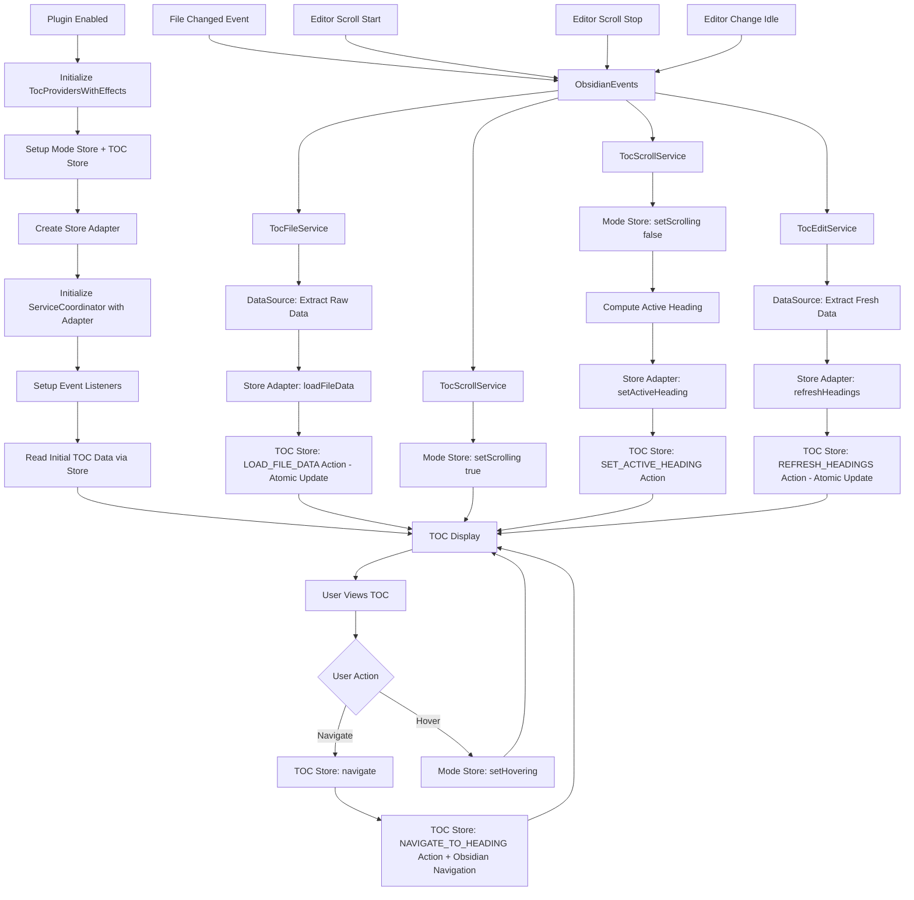

# Overview

The plugin mounts a lightweight React root as a floating overlay within the Obsidian workspace. The overlay renders a Table of Contents (TOC) that operates in two display modes sharing the same data source:
- Preview mode: compact tree hierarchy for quick structure overview (default state)
- Detail mode: interactive scrollable table of contents (appears on hover, closes when mouse leaves)

Both modes access the same headings list from metadataCache - they differ only in display style and interaction level. The active heading is tracked using line-based position detection. 


# Data Layer

## Data Source
### ObsidianDataSource (`ui/datasources/obsidianDataSource.ts`)

**Purpose**: Raw access to Obsidian APIs for file metadata and heading extraction.

**Interface**: `IObsidianDataSource` and `IObsidianNavigator`
```typescript
interface IObsidianDataSource {
  getActiveFile(): TFile | null;
  getMarkdownFiles(): TFile[];
  extractFileMetadata(file: TFile | null): ObsidianFile | null;
  extractHeadings(file: TFile | null): ObsidianHeading[];
  isCacheAvailable(file: TFile | null): boolean;
  getRawCache(file: TFile | null): any;
  // TOC data operations with transformation
  getCurrentFileTocData(): TocData | null;
  getFileTocData(file: TFile | null): TocFile | null;
}

interface IObsidianNavigator {
  goToLine(line: number, options?: { center?: boolean }): void;
}
```

**Responsibilities**:
- File system operations using `app.vault`
- Metadata cache access via `app.metadataCache`
- Raw heading extraction from cache
- Active file detection via `app.workspace`
- Navigation operations (scroll, cursor positioning) via `app.workspace` and editor APIs
- Error handling for invalid files/cache states

**Implementation**: `ObsidianDataSource` class that implements both `IObsidianDataSource` and `IObsidianNavigator` interfaces. Focuses solely on raw data extraction without UI concerns.

### ObsidianEvents (`ui/datasources/obsidianEvents.ts`)

**Purpose**: Event abstraction layer that decouples business logic from Obsidian runtime events.

**Interface**: `IObsidianEvents`
```typescript
interface IObsidianEvents {
  onFileOpen(cb: (path: string) => void): () => void;
  onFileChanged(cb: (path: string) => void): () => void;
  onEditorScrollStart(cb: () => void): () => void;
  onEditorScrollStop(cb: () => void): () => void;
  onEditorChangeIdle(cb: (path: string) => void): () => void;
  getCurrentScrollLine(): number | null;
}
```

**Responsibilities**:
- File change event handling (`metadataCache.on('changed')`, `vault.on('modify')`, `vault.on('rename')`)
- Editor scroll event detection with debouncing (150ms for scroll stop)
- Editor content change detection with debouncing (300ms for edit idle)
- Current scroll line position detection via `editor.getCursor().line`
- Event listener lifecycle management and cleanup
- Isolation of all Obsidian runtime dependencies

**Implementation**: `ObsidianEvents` class with proper debouncing, cleanup, and error handling.

## Navigation
### ObsidianNavigator (`ui/datasources/navigator.ts`)

**Purpose**: Provides navigation capabilities for moving between headings in the active editor.

**Interface**: `IObsidianNavigator`
```typescript
interface IObsidianNavigator {
  goToLine(line: number, options?: { center?: boolean }): void;
}
```

**Responsibilities**:
- Line-based navigation to specific positions in the editor
- Cursor positioning and viewport scrolling
- Integration with Obsidian's MarkdownView and editor APIs
- Graceful fallback when no active editor is available

**Implementation**: Integrated into `ObsidianDataSource` class to maintain single responsibility for all Obsidian API interactions.


# Business Logic Layer

## Data Processing

### TocDataProcessor (`ui/services/tocDataProcessor.ts`)
**Purpose**: Encapsulates business logic for data processing and validation

**Interface**: `ITocDataProcessor`
```typescript
interface ITocDataProcessor {
  processFileData(file: TFile, obsidianFile: ObsidianFile, obsidianHeadings: ObsidianHeading[]): TocFile | null;
}
```

**Responsibilities**:
- Transform raw Obsidian data to TOC format using utilities
- Apply business rules and validation
- Handle error cases and logging
- Encapsulate complex data processing logic

# Services Layer

## Event Coordination Services

### TocFileService (`ui/services/tocFileService.ts`)
**Purpose**: File change event coordination
**Responsibilities**:
- Handle file open/change events
- Extract raw data from data source
- Delegate business logic to store via adapter

### TocScrollService (`ui/services/tocScrollService.ts`)
**Purpose**: Scroll event coordination
**Responsibilities**:
- Handle scroll events
- Update mode store (scrolling state)
- Calculate active heading and delegate to store via adapter

### TocEditService (`ui/services/tocEditService.ts`)
**Purpose**: Edit event coordination
**Responsibilities**:
- Handle editor change events
- Extract fresh data and delegate refresh to store via adapter

### TocServiceCoordinator (`ui/services/tocServiceCoordinator.ts`)

**Purpose**: Orchestrates all event coordination services.

**Interface**:
```typescript
class TocServiceCoordinator {
  constructor(
    events: IObsidianEvents,
    dataSource: IObsidianDataSource,
    tocStore: ITocStoreAdapter,
    modeStore: ITocModeStoreAdapter
  );
  init(): () => void; // Returns cleanup function
  loadInitialData(): Promise<void>;
}
```

**Responsibilities**:
- Coordinate focused event services
- Initialize all event listeners
- Load initial TOC data via store adapter
- Provide unified cleanup interface


# UI Layer

## Store Architecture

The UI layer uses a split-store architecture with clear separation of concerns:

### Mode Store (`ITocModeStore`)
**Purpose**: Manages UI interaction state and display mode computation
**Location**: `ui/stores/tocModeStore.tsx`

**Interface**:
```typescript
interface ITocModeStore {
  // State
  isHovering: boolean;
  isScrolling: boolean;
  isNavigating: boolean;
  
  // Actions
  setHovering(isHovering: boolean): void;
  setScrolling(isScrolling: boolean): void;
  setNavigating(isNavigating: boolean): void;
  
  // Selectors
  getDisplayMode(): TocUIMode;
  isPreviewMode(): boolean;
  isDetailMode(): boolean;
}
```

**Responsibilities**:
- Track user interaction states (hover, scroll, navigation)
- Compute display mode based on interaction state
- Provide mode-related selectors for components

### TOC Store (`ITocStore`)
**Purpose**: Manages TOC data and navigation operations with atomic business actions
**Location**: `ui/stores/tocStore.tsx`

**Interface**:
```typescript
interface ITocStore {
  // State
  activeFile: string | null;
  activeHeadingId: string | null;
  headings: TocHeading[];
  
  // Granular Actions (for internal use)
  setActiveFile(filePath: string | null): void;
  setActiveHeading(headingId: string | null): void;
  setHeadings(headings: TocHeading[]): void;
  
  // Business Logic Actions (atomic operations)
  loadFileData(file: TFile, obsidianFile: ObsidianFile, obsidianHeadings: ObsidianHeading[]): void;
  refreshHeadings(file: TFile, obsidianFile: ObsidianFile, obsidianHeadings: ObsidianHeading[]): void;
  navigate(headingId: string): void;
  
  // Selectors
  getActiveHeading(): TocHeading | null;
  getHeadingsByLevel(level: number): TocHeading[];
}
```

**Responsibilities**:
- Manage document structure data (headings, active file)
- Provide atomic business operations that prevent intermediate states
- Handle navigation operations with Obsidian integration
- Provide data-related selectors for components

### TOC Reducer (`tocReducer`)
**Purpose**: Pure state management with atomic domain actions
**Location**: `ui/stores/tocReducer.ts`

**Action Types**:
```typescript
type TocAction =
  // Granular actions (for internal store operations)
  | { type: 'SET_ACTIVE_FILE'; payload: string | null }
  | { type: 'SET_ACTIVE_HEADING'; payload: string | null }
  | { type: 'SET_HEADINGS'; payload: TocHeading[] }
  // Domain-level atomic actions (for business operations)
  | { type: 'LOAD_FILE_DATA'; payload: { file: TFile; obsidianFile: ObsidianFile; obsidianHeadings: ObsidianHeading[] } }
  | { type: 'REFRESH_HEADINGS'; payload: { file: TFile; obsidianFile: ObsidianFile; obsidianHeadings: ObsidianHeading[] } }
  | { type: 'NAVIGATE_TO_HEADING'; payload: { headingId: string } };
```

**Responsibilities**:
- Handle all state transitions in a pure, predictable manner
- Process domain actions atomically (single dispatch, single re-render)
- Integrate with `TocDataProcessor` for business logic
- Maintain data consistency and validation

### Provider Integration
**Location**: `ui/stores/tocProvidersWithEffects.tsx`

**Architecture**:
- **Top-level**: Mode provider (global UI state)
- **Container-level**: TOC provider (document-specific data)
- **Store Adapter**: Simple interface for services to interact with store
- **Effects integration**: Service coordinator uses store adapter for business operations

## Component Architecture

### Container Components
- **TocContainer**: Fixed overlay at middle-left; switches between preview and detail views based on mode
- **TocPreviewView**: Preview tree in the shape of lines with different lengths for different levels
- **TocDetailView**: Table of contents showing 5–8 items at once; scrollable; active item highlighted; heading text truncated with ellipsis

### Hook Design
- **`useTocMode()`**: Access to interaction state and display mode
- **`useToc()`**: Access to TOC data and navigation
- **`useNavigate()`**: Coordinates between both stores for navigation
- **`useActiveHeading()`**: Focused access to active heading data

### Component Responsibilities
- **Pure Presentational**: Components receive data via props, no direct store access
- **Focused Hooks**: Each hook provides access to a specific store concern
- **Coordinated Actions**: Navigation operations coordinate between stores as needed

## Design Token
All styling relies on Obsidian CSS variables to match themes and avoid hard-coded colors.

# Data Flow



## CRUD Operations Summary
- **Create**: Plugin activation generates initial TOC data models
- **Read**: TOC displays current data models to user
- **Update/Delete**: File changes trigger data model replacement


# Obsidian API Integration

## Plugin Lifecycle
- Lifecycle: extend Plugin; mount in onload, unmount in onunload
- Container: append overlay root to app.workspace.containerEl with a scoped class for positioning
- Settings: addSettingTab, persist with loadData/saveData
- Theming: use Obsidian CSS variables (e.g., --text-normal, --background-secondary) and avoid hard-coded colors

## Event-Driven Architecture
The new architecture uses a layered event system that maintains separation of concerns:

### Integration Wiring (main.ts)
```typescript
// In React view initialization
const events = new ObsidianEvents(this.app);
const dataSource = new ObsidianDataSource(this.app);

// Initialize providers with service coordinator
<TocProvidersWithEffects app={this.app} navigator={dataSource}>
  <TocContainer visible={true} />
</TocProvidersWithEffects>
```

### Event Flow
1. **Obsidian Events** → `ObsidianEvents` (data layer abstraction)
2. **Event Coordination** → Focused Services (`TocFileService`, `TocScrollService`, `TocEditService`)
3. **Store Interaction** → Store Adapter (simple interface for services)
4. **Data Processing** → `TocDataProcessor` + utility functions (pure transformations)
5. **State Management** → Atomic store actions (single dispatch per business operation)
6. **UI Updates** → React components via focused store hooks (single re-render per operation)

### Side Effects Implementation
- **File changes**: `metadataCache.on('changed')` + `vault.on('modify')` → `TocFileService` → Store Adapter: `loadFileData()` → TOC Store: `LOAD_FILE_DATA` atomic action
- **Editor scrolling**: Editor scroll events → `TocScrollService` → Mode Store: `setScrolling` + Store Adapter: `setActiveHeading()` → TOC Store: `SET_ACTIVE_HEADING` action  
- **User editing**: Editor change events (debounced) → `TocEditService` → Store Adapter: `refreshHeadings()` → TOC Store: `REFRESH_HEADINGS` atomic action

## How React Components Access Data
- **Focused Store Hooks**: `useToc()`, `useTocMode()`, `useActiveHeading()`, `useNavigate()`
- **Business Operations**: Via store adapter, not direct store access from services
- **Atomic Updates**: All business operations result in single re-renders via atomic reducer actions
- **DataSource Access**: Via service effects and store adapter, not direct component access
- **Obsidian Context**: `useObsidianApp()` hook only for initialization, not in components
- **Pure Components**: UI components receive data via props from focused hooks, no Obsidian API coupling
- **Store Coordination**: `useNavigate()` coordinates between Mode Store and TOC Store for navigation operations


