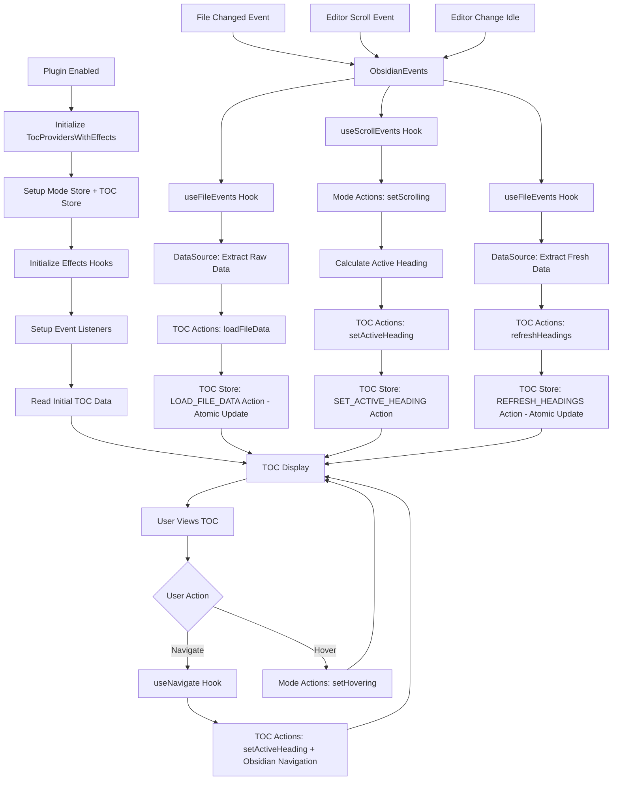

# Overview

The plugin mounts a lightweight React root as a floating overlay within the Obsidian workspace. The overlay renders a Table of Contents (TOC) that operates in two display modes sharing the same data source:
- Preview mode: compact tree hierarchy for quick structure overview (default state)
- Detail mode: interactive scrollable table of contents (appears on hover, closes when mouse leaves)

Both modes access the same headings list from metadataCache - they differ only in display style and interaction level. The active heading is tracked using line-based position detection. 


# Data Layer

## Data Source
### ObsidianDataSource (`ui/datasources/obsidianDataSource.ts`)

**Purpose**: Raw access to Obsidian APIs for file metadata and heading extraction.

**Interface**: `IObsidianDataSource` and `IObsidianNavigator`
```typescript
interface IObsidianDataSource {
  getActiveFile(): TFile | null;
  getMarkdownFiles(): TFile[];
  extractFileMetadata(file: TFile | null): ObsidianFile | null;
  extractHeadings(file: TFile | null): ObsidianHeading[];
  isCacheAvailable(file: TFile | null): boolean;
  getRawCache(file: TFile | null): any;
}

interface IObsidianNavigator {
  goToLine(line: number, options?: { center?: boolean }): void;
}
```

**Responsibilities**:
- File system operations using `app.vault`
- Metadata cache access via `app.metadataCache`
- Raw heading extraction from cache
- Active file detection via `app.workspace`
- Navigation operations (scroll, cursor positioning) via `app.workspace` and editor APIs
- Error handling for invalid files/cache states

**Implementation**: `ObsidianDataSource` class that implements both `IObsidianDataSource` and `IObsidianNavigator` interfaces. Focuses solely on raw data extraction without UI concerns.

### ObsidianEvents (`ui/datasources/obsidianEvents.ts`)

**Purpose**: Event abstraction layer that decouples business logic from Obsidian runtime events.

**Interface**: `IObsidianEvents`
```typescript
interface IObsidianEvents {
  onFileOpen(cb: (path: string) => void): () => void;
  onFileChanged(cb: (path: string) => void): () => void;
  onModeChange(cb: (mode: 'source' | 'preview') => void): () => void;
  onScroll(cb: () => void): () => void;
  onEditorChangeIdle(cb: (path: string) => void): () => void;
  getCurrentViewportRange(): ViewportRange | null;
  cleanup(): void;
}
```

**Responsibilities**:
- File change event handling (`metadataCache.on('changed')`, `vault.on('modify')`, `vault.on('rename')`)
- Editor scroll event detection with debouncing (150ms for scroll stop)
- Editor content change detection with debouncing (300ms for edit idle)
- Viewport range calculation for active heading detection
- Event listener lifecycle management and cleanup
- Isolation of all Obsidian runtime dependencies

**Implementation**: `ObsidianEvents` class with proper debouncing, cleanup, and error handling.

## Navigation
### ObsidianNavigator (`ui/datasources/navigator.ts`)

**Purpose**: Provides navigation capabilities for moving between headings in the active editor.

**Interface**: `IObsidianNavigator`
```typescript
interface IObsidianNavigator {
  goToLine(line: number, options?: { center?: boolean }): void;
}
```

**Responsibilities**:
- Line-based navigation to specific positions in the editor
- Cursor positioning and viewport scrolling
- Integration with Obsidian's MarkdownView and editor APIs
- Graceful fallback when no active editor is available

**Implementation**: Integrated into `ObsidianDataSource` class to maintain single responsibility for all Obsidian API interactions.


# Business Logic Layer

## Data Processing

### TocDataProcessor (`ui/utils/tocTransformers.ts`)
**Purpose**: Encapsulates business logic for data processing and validation

**Responsibilities**:
- Transform raw Obsidian data to TOC format using utilities
- Apply business rules and validation
- Handle error cases and logging
- Encapsulate complex data processing logic

# UI Layer

## Store Architecture

The UI layer uses a React Context + Reducer architecture following React's official patterns:

### TOC Context (`ui/stores/TocContext.tsx`)
**Purpose**: Manages TOC data and navigation operations with atomic business actions
**Location**: `ui/stores/TocContext.tsx`

**Interface**:
```typescript
interface TocState {
  activeFile: string | null;
  activeHeadingId: string | null;
  headings: TocHeading[];
}

type TocAction =
  | { type: 'SET_ACTIVE_FILE'; payload: string | null }
  | { type: 'SET_ACTIVE_HEADING'; payload: string | null }
  | { type: 'SET_HEADINGS'; payload: TocHeading[] }
  | { type: 'LOAD_FILE_DATA'; payload: { filePath: string; headings: TocHeading[] } }
  | { type: 'REFRESH_HEADINGS'; payload: { headings: TocHeading[] } }
  | { type: 'NAVIGATE_TO_HEADING'; payload: { headingId: string } };
```

**Responsibilities**:
- Manage document structure data (headings, active file)
- Provide atomic business operations that prevent intermediate states
- Handle navigation operations with Obsidian integration
- Provide data-related selectors for components

### TOC Mode Context (`ui/stores/TocModeContext.tsx`)
**Purpose**: Manages UI interaction state and display mode computation
**Location**: `ui/stores/TocModeContext.tsx`

**Interface**:
```typescript
interface TocInteractionState {
  isHovering: boolean;
  isScrolling: boolean;
  isNavigating: boolean;
}

type TocModeAction =
  | { type: 'SET_HOVERING'; payload: boolean }
  | { type: 'SET_SCROLLING'; payload: boolean }
  | { type: 'SET_NAVIGATING'; payload: boolean };
```

**Responsibilities**:
- Track user interaction states (hover, scroll, navigation)
- Compute display mode based on interaction state
- Provide mode-related selectors for components

### Provider Integration
**Location**: `ui/stores/TocProvidersWithEffects.tsx`

**Architecture**:
- **Top-level**: Mode provider (global UI state)
- **Container-level**: TOC provider (document-specific data)
- **Effects integration**: Custom hooks handle Obsidian event coordination

## Effects Architecture

### Custom Hooks (`ui/hooks/useTocEffects.ts`)
**Purpose**: Handle Obsidian event coordination and side effects

**Hooks**:
- `useObsidianDataSources()`: Initialize data source and events instances
- `useFileEvents()`: Handle file open/change/edit idle events
- `useScrollEvents()`: Handle scroll events with debouncing
- `useInitialData()`: Load initial TOC data on mount

**Responsibilities**:
- Coordinate between Obsidian events and store actions
- Handle business logic for data processing
- Manage event listener lifecycle and cleanup
- Provide focused, reusable hook interfaces

### Navigation Hook (`ui/hooks/useNavigate.ts`)
**Purpose**: Coordinates between both stores for navigation operations

**Responsibilities**:
- Coordinate between TOC store and Mode store for navigation state
- Handle navigation side effects with Obsidian integration
- Provide navigation functions for components

## Component Architecture

### Container Components
- **TocContainer**: Fixed overlay at middle-left; switches between preview and detail views based on mode
- **TocPreviewView**: Preview tree in the shape of lines with different lengths for different levels
- **TocDetailView**: Table of contents showing 5–8 items at once; scrollable; active item highlighted; heading text truncated with ellipsis

### Hook Design
- **`useToc()`**: Access to TOC state
- **`useTocActions()`**: Access to TOC actions
- **`useTocSelectors()`**: Access to computed TOC values
- **`useTocMode()`**: Access to interaction state
- **`useTocModeActions()`**: Access to mode actions
- **`useTocModeSelectors()`**: Access to computed mode values
- **`useNavigate()`**: Coordinates between both stores for navigation

### Component Responsibilities
- **Pure Presentational**: Components receive data via props, no direct store access
- **Focused Hooks**: Each hook provides access to a specific store concern
- **Coordinated Actions**: Navigation operations coordinate between stores as needed

## Design Token
All styling relies on Obsidian CSS variables to match themes and avoid hard-coded colors.

# Data Flow



## CRUD Operations Summary
- **Create**: Plugin activation generates initial TOC data models
- **Read**: TOC displays current data models to user
- **Update/Delete**: File changes trigger data model replacement


# Obsidian API Integration

## Plugin Lifecycle
- Lifecycle: extend Plugin; mount in onload, unmount in onunload
- Container: append overlay root to app.workspace.containerEl with a scoped class for positioning
- Settings: addSettingTab, persist with loadData/saveData
- Theming: use Obsidian CSS variables (e.g., --text-normal, --background-secondary) and avoid hard-coded colors

## Event-Driven Architecture
The architecture uses a hook-based event system that maintains separation of concerns:

### Integration Wiring (main.ts)
```typescript
// In React view initialization
<TocProvidersWithEffects app={this.app} navigator={dataSource}>
  <TocContainer visible={true} />
</TocProvidersWithEffects>
```

### Event Flow
1. **Obsidian Events** → `ObsidianEvents` (data layer abstraction)
2. **Event Coordination** → Custom Hooks (`useFileEvents`, `useScrollEvents`)
3. **Store Interaction** → Direct store actions (no adapters needed)
4. **Data Processing** → Utility functions (pure transformations)
5. **State Management** → Atomic store actions (single dispatch per business operation)
6. **UI Updates** → React components via focused store hooks (single re-render per operation)

### Side Effects Implementation
- **File changes**: `metadataCache.on('changed')` + `vault.on('modify')` → `useFileEvents` → TOC Actions: `loadFileData()` → TOC Store: `LOAD_FILE_DATA` atomic action
- **Editor scrolling**: Editor scroll events → `useScrollEvents` → Mode Actions: `setScrolling` + TOC Actions: `setActiveHeading()` → TOC Store: `SET_ACTIVE_HEADING` action  
- **User editing**: Editor change events (debounced) → `useFileEvents` → TOC Actions: `refreshHeadings()` → TOC Store: `REFRESH_HEADINGS` atomic action

## How React Components Access Data
- **Focused Store Hooks**: `useToc()`, `useTocActions()`, `useTocSelectors()`, `useTocMode()`, `useTocModeActions()`, `useTocModeSelectors()`
- **Business Operations**: Direct store actions, no adapters needed
- **Atomic Updates**: All business operations result in single re-renders via atomic reducer actions
- **DataSource Access**: Via custom hooks, not direct component access
- **Obsidian Context**: `useObsidianApp()` hook only for initialization, not in components
- **Pure Components**: UI components receive data via props from focused hooks, no Obsidian API coupling
- **Store Coordination**: `useNavigate()` coordinates between Mode Store and TOC Store for navigation operations

## ✅ **Final Architecture Summary**

### **Completed Refactoring Work**

The Floating TOC plugin has undergone a comprehensive architectural evolution to align with React's official patterns and best practices:

#### **1. React-Aligned Store Architecture**
- **Separate Contexts**: Implemented separate contexts for state and dispatch following React documentation
- **Consolidated Files**: Each domain (TOC, Mode) consolidated into single files with context + reducer + provider + hooks
- **Performance Optimized**: Components only subscribe to what they need, preventing unnecessary re-renders

#### **2. Modern Hook Patterns**
- **Migrated from Legacy**: Replaced legacy patterns with React-aligned hooks
- **Separated Concerns**: `useToc()` (state), `useTocActions()` (actions), `useTocSelectors()` (computed values)
- **Cross-Store Coordination**: `useNavigate()` coordinates between two contexts
- **Effects Integration**: Custom hooks handle all Obsidian event coordination

#### **3. Simplified Architecture**
- **Removed Services Layer**: Replaced service classes with focused custom hooks
- **Direct Store Access**: No adapters needed - hooks directly interact with stores
- **Cleaner Dependencies**: Simplified import paths throughout the codebase
- **Better Performance**: Direct hook calls instead of service method calls

#### **4. Bundle Optimization**
- **Dependency Cleanup**: Removed unused dependencies
- **Production Minification**: Added comprehensive minification
- **Tree Shaking**: Optimized bundle with proper external dependencies

#### **5. Error Handling**
- **Comprehensive Error Boundaries**: Added error boundaries throughout component tree
- **Graceful Degradation**: Components handle errors gracefully with retry functionality
- **Development Support**: Detailed error information in development mode

#### **6. Clean Architecture**
- **Eliminated Legacy Patterns**: Removed all legacy implementations
- **React Best Practices**: Follows official React documentation patterns exactly
- **Maintainable Code**: Clear separation of concerns and predictable state management

### **Final Directory Structure**

```
ui/
├── stores/                    # ✅ Consolidated store logic
│   ├── TocContext.tsx         # TOC store: context + reducer + provider + hooks
│   ├── TocModeContext.tsx     # Mode store: context + reducer + provider + hooks
│   ├── TocProviders.tsx        # Combined providers
│   └── TocProvidersWithEffects.tsx # Providers with effects integration
├── hooks/                     # ✅ Effects and coordination hooks
│   ├── useNavigate.ts         # Coordinates between TOC and Mode stores
│   ├── useTocEffects.ts       # Obsidian event coordination hooks
│   └── index.ts               # Hook exports
├── components/                # Pure presentational components
├── datasources/               # Obsidian API abstraction
├── utils/                     # Pure transformation utilities
└── schemas/                   # Type definitions
```

### **Key Architectural Decisions**

1. **Hook-Based Effects**: Replaced service classes with focused custom hooks for better React integration
2. **Direct Store Access**: No adapters needed - hooks directly interact with stores
3. **React-Aligned Patterns**: Follow official React documentation for reducer + context
4. **Performance First**: Separate contexts prevent unnecessary re-renders
5. **Clean Dependencies**: Simplified architecture with fewer abstraction layers

### **Results Achieved**

- **✅ Simplified Architecture**: Removed service layer complexity
- **✅ Zero TypeScript Errors**: Clean, type-safe codebase
- **✅ React Best Practices**: Aligned with official React documentation
- **✅ Better Performance**: Optimized re-rendering with separate contexts
- **✅ Maintainable Architecture**: Clear separation of concerns
- **✅ Comprehensive Error Handling**: Graceful error recovery throughout

The architecture is now production-ready, highly optimized, and follows React's official patterns for scaling up with reducer and context.